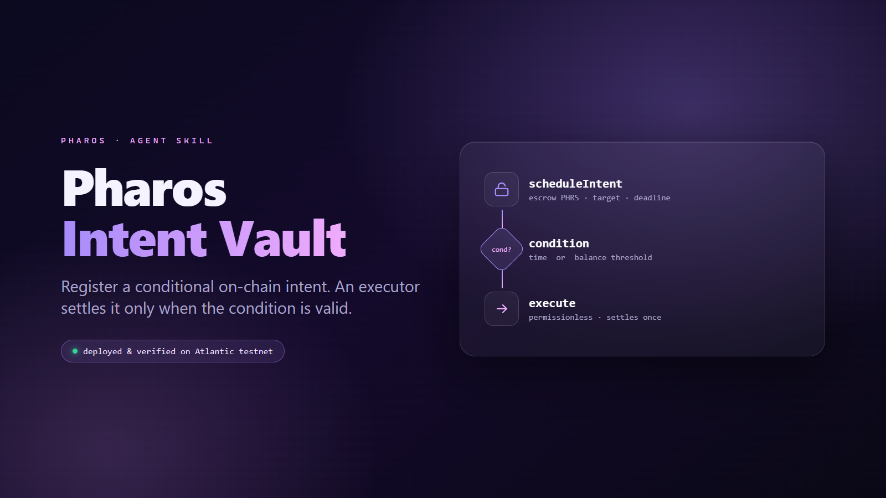

# Pharos IntentVault

A reusable, condition-gated on-chain execution primitive for AI agents on Pharos Atlantic.

## How It Works

An agent registers an intent by calling `scheduleIntent`, locking PHRS in escrow and specifying:

- a **target** (recipient address or contract),
- optional **calldata**,
- a **condition** (time-lock, balance-below, or balance-above), and
- an **expiry** deadline.

An agent runner, keeper, or any EOA then calls `execute(id)` at any point. The contract settles the
intent — transferring the escrowed PHRS to the target and invoking the calldata — only if all of the
following hold at execution time:

1. The intent is still Active (not already Executed, Cancelled, or Reclaimed).
2. `block.timestamp <= expiry` (not past deadline).
3. The condition is satisfied (time reached, or balance crossed threshold).

If any check fails, `execute` reverts with a precise custom error. The contract does not fire by
itself; an external caller is always required.

## Deployed Contract

- **Network:** Pharos Atlantic testnet (chain ID 688689)
- **Contract:** `0x10f1d2a0B6A60ec8A872fbe46a909021EDd7a217`
- **Explorer:** https://atlantic.pharosscan.xyz/address/0x10f1d2a0B6A60ec8A872fbe46a909021EDd7a217
- **Source verification:** verified on the explorer (Pass - Verified)

### Live demo (on-chain proof)

A real schedule -> execute round-trip on Atlantic testnet (intent #0): the agent escrowed 0.001 PHRS
under a TIME condition, then a keeper settled it once the condition held.

| Step | Transaction |
|---|---|
| `scheduleIntent` (escrow 0.001 PHRS, TIME condition) | [0x142e…0057](https://atlantic.pharosscan.xyz/tx/0x142e439b268705d0b46d8263876ad6b83a1e4c815f80e0fd55680c2dbb480057) |
| `execute` (condition met, escrow settled to target) | [0x1c2b…35df](https://atlantic.pharosscan.xyz/tx/0x1c2b5ee5c987be226b0a329e20b59567fe4289c9ab3da2ed92b4fec6a4b435df) |

Reproduce with:

```bash
forge script script/Demo.s.sol:Demo --rpc-url https://atlantic.dplabs-internal.com --broadcast
```

(requires a funded deployer key in `.env`).

## Quickstart

### Run Tests

```bash
forge test -v
# 18 tests pass; includes fuzzed solvency invariant
```

### Run Demo (requires funded wallet)

```bash
export VAULT=0x10f1d2a0B6A60ec8A872fbe46a909021EDd7a217
export PK=0x<your-private-key>
export TARGET=<recipient-address>
bash demo/run_demo.sh
```

The demo schedules a 0.01 PHRS transfer with a 60-second time condition, polls `canExecute`, then
settles the intent.

## Security Model

- **Isolated escrow accounting.** Each intent's PHRS is tracked in `totalEscrowed`. The contract
  enforces `balance >= totalEscrowed` as a fuzzed solvency invariant (256 runs, depth 32). Escrow
  from one intent is never accessible to another. Forced ether (e.g. via `selfdestruct`) can only
  push `balance` above `totalEscrowed`, never below — it cannot make the vault insolvent or affect
  any intent's escrow (`test_forcedEth_keepsSolvencyAndIsolation`).

- **One-shot settlement.** Once an intent is Executed, Cancelled, or Reclaimed, its status is
  permanently terminal. No double-spend path exists.

- **Expiry-based reclaim.** If an intent expires unsettled, only the original owner can recover the
  escrowed funds via `reclaim`, and only after `block.timestamp > expiry`.

- **Reentrancy protection.** The vault uses a `nonReentrant` modifier (bool lock) on all
  state-changing functions. Settlement follows checks-effects-interactions: status is updated and
  `totalEscrowed` decremented before the external call fires.

- **Returndata-bomb mitigation.** The external call in `execute` uses inline assembly
  (`call(gas(), target, val, ...)` with zero output-buffer size) to prevent a malicious target from
  forcing excess returndata memory allocation on the executor.

- **Hardened external call.** `SelfCallForbidden` blocks the vault from targeting itself.
  `ZeroTarget` blocks the zero address. Both are checked at schedule time, not just at execute time.

The contract is audit-friendly and invariant-tested. It has not been formally audited.

## CertiK Skill Scanner Readiness

CertiK's Skill Scanner (the hackathon's security standard) evaluates five runtime risk classes. This
skill is a Solidity contract plus markdown that drives `cast`/`forge` against the declared Pharos
Atlantic RPC. It clears all five by construction:

| CertiK risk class | Status in this skill |
|---|---|
| Malicious behavior | None. Deterministic contract + documented commands; no hidden logic. |
| Data exfiltration | None. No outbound calls except the declared Atlantic RPC. |
| Unauthorized network activity | None. The only endpoint is `https://atlantic.dplabs-internal.com`. |
| Shell execution | None. No `child_process` / `exec` / `eval` / dynamic code anywhere. |
| Filesystem misuse | None. No file reads or writes. The only secret, `PRIVATE_KEY`, is a user-supplied signing env var the skill never reads, stores, or logs. |

Reproducible local pre-audit:

- **Pattern scan** of all authored files: no shell-exec, `eval`, `fetch`/`axios`, websocket, or
  exfiltration patterns. Every key reference is the standard, explicitly-cautioned `cast --private-key`
  signing usage; no hardcoded keys.
- **Secret scan** (full git history + working tree): `.env` was never committed in any commit; no
  private keys, seeds, or credentials anywhere in history or tracked files.
- **Slither 0.11.5**: 0 high, 0 medium. Only informational notes — `block.timestamp` comparisons
  (intrinsic to time conditions), one inline-assembly block (the returndata-bomb mitigation in
  `execute`), and two low-level calls (native-PHRS refunds in `cancel`/`reclaim`). All intentional.
- **18 Foundry tests** including a fuzzed solvency invariant (256 runs, depth 32).
- **Four adversarial review passes** (one in-house audit plus three independent LLM red-teams) — no exploitable findings.

## Conditions

Version 1 ships two condition types evaluated entirely on-chain with no oracle dependency:

| Type | `cType` | Condition |
|---|---|---|
| `TIME` | `0` | `block.timestamp >= threshold` (threshold is a Unix timestamp in seconds) |
| `BALANCE_BELOW` | `1` | `subject.balance <= threshold` (native PHRS balance of a watched account) |
| `BALANCE_ABOVE` | `2` | `subject.balance >= threshold` (native PHRS balance of a watched account) |

### Phase-2: Price Oracle Conditions

`src/IConditionOracle.sol` defines the `IConditionOracle` interface for a future `PRICE`
condition type:

```solidity
interface IConditionOracle {
    function isMet(bytes calldata params) external view returns (bool met);
}
```

A Phase-2 adapter would implement this interface against a Chainlink or Pyth price feed and be
wired into a new `cType` value. The interface is shipped in v1 as a documented extension point;
it is not called by the current contract.

## Phase-2: Autonomous Agent Treasury

The vault's primitives compose into a lightweight autonomous treasury for an agent:

- **Recurring payment:** Agent schedules a TIME intent each period, keeper settles at the deadline,
  funds reach the recipient without agent availability.
- **Conditional top-up:** BALANCE_BELOW intent fires when an operational wallet drops below a safe
  threshold, automatically refilling it from an escrow reserve.
- **Conditional rebalancing:** BALANCE_ABOVE intent fires when a target wallet accumulates beyond a
  ceiling, routing excess to a treasury address.
- **Oracle-gated execution (Phase-2):** A PRICE condition feeds from an on-chain oracle; the agent
  schedules a buy/sell action that only settles when the asset reaches the target price.

Each intent is independent, isolated, and permissionlessly executable by any keeper — no centralized
cron or trusted operator required.

## Project Layout

```
src/
  IntentVault.sol              Core contract
  IConditionOracle.sol         Phase-2 oracle extension interface
test/
  IntentVault.t.sol            Unit tests
  IntentVault.invariant.t.sol  Fuzzed solvency invariant
script/                        Deployment scripts
assets/
  networks.json                Network configuration
references/
  intent-vault.md              Full agent-facing capability reference
demo/
  run_demo.sh                  End-to-end demo runner
SKILL.md                       Pharos skill-engine manifest
```

## License

MIT
